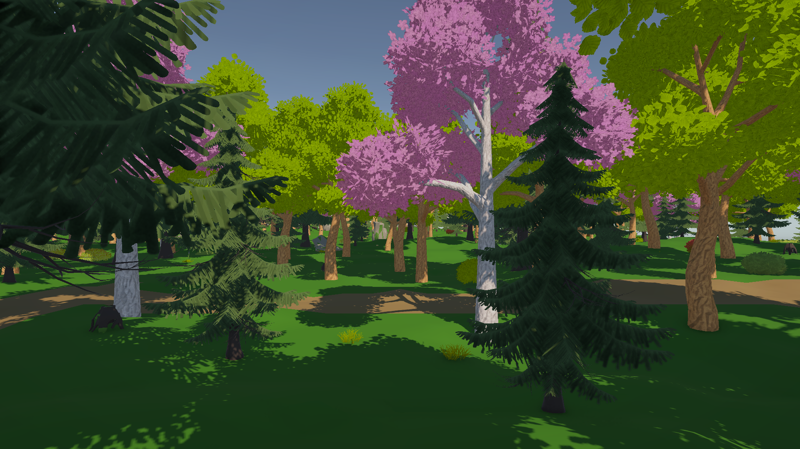
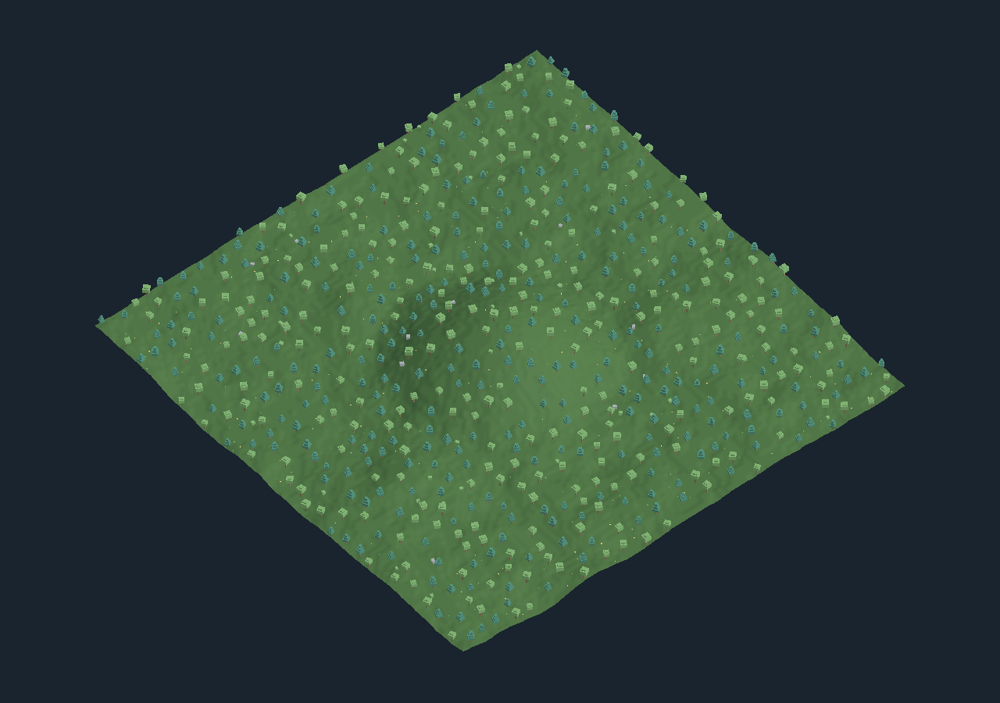
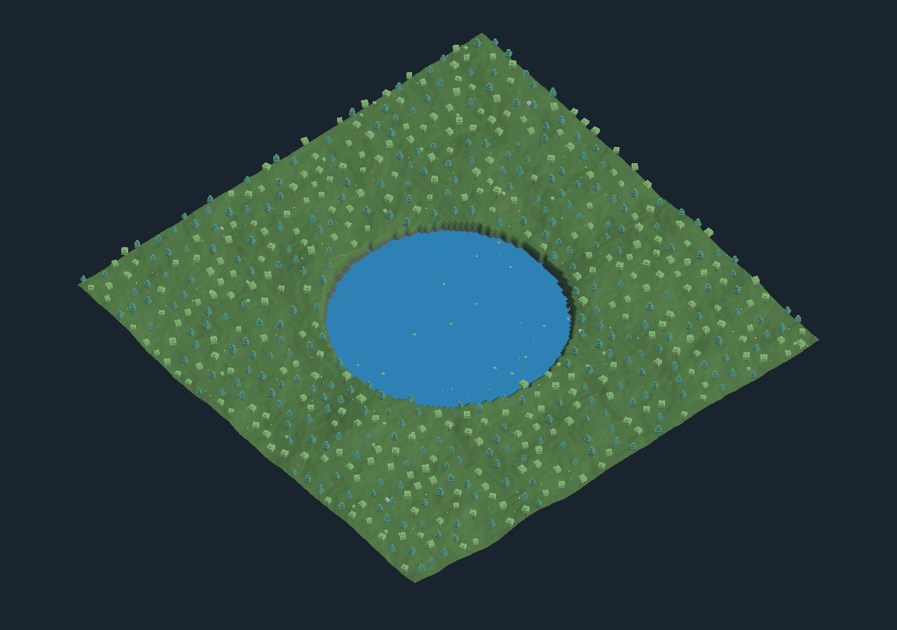
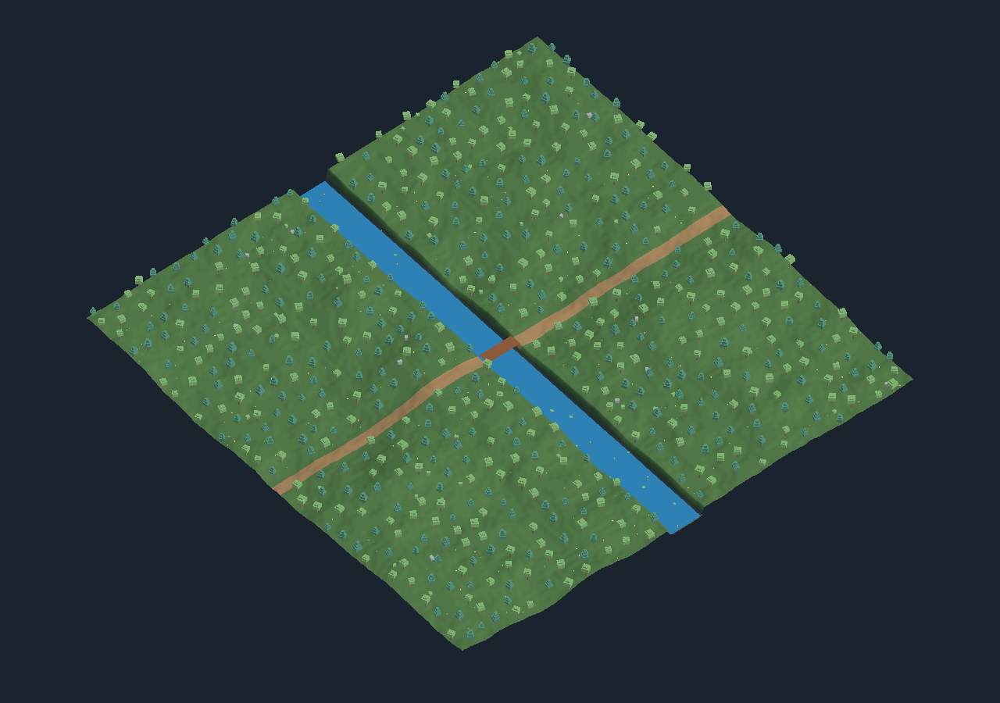
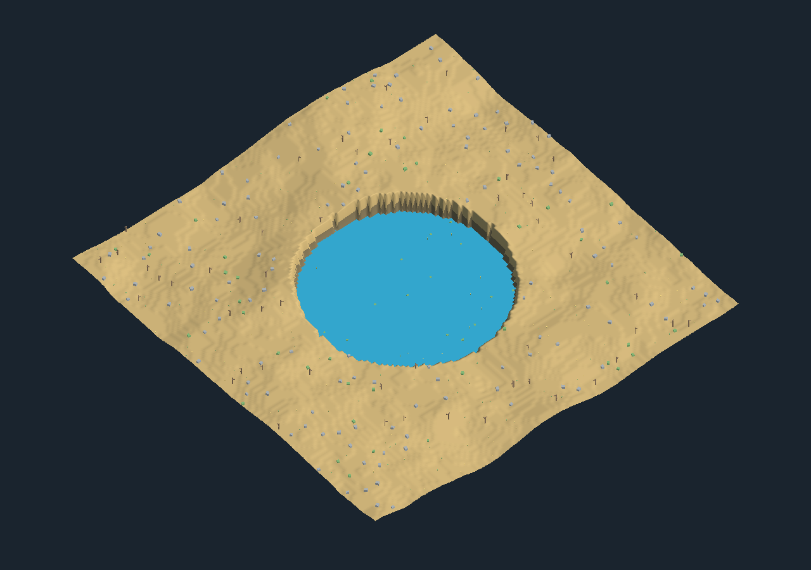
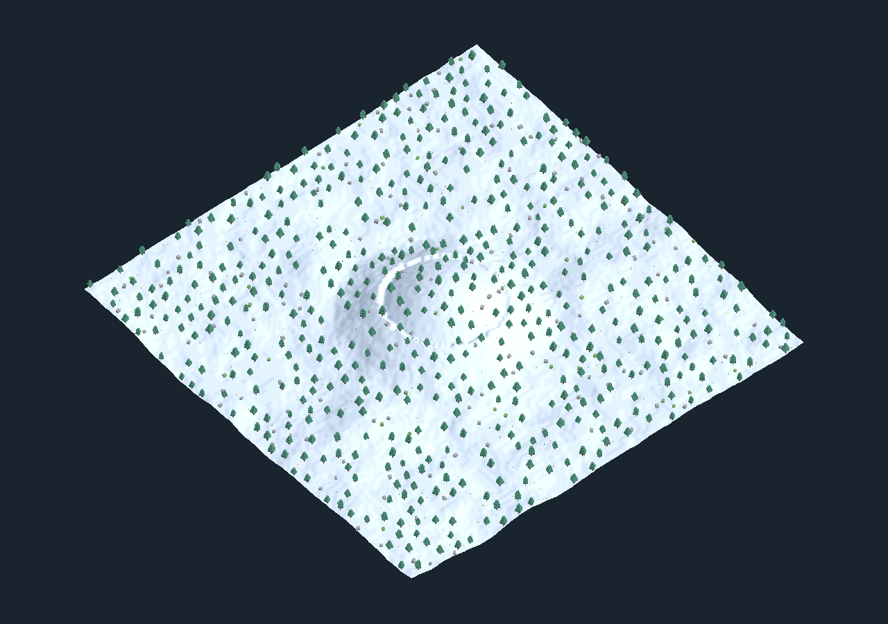
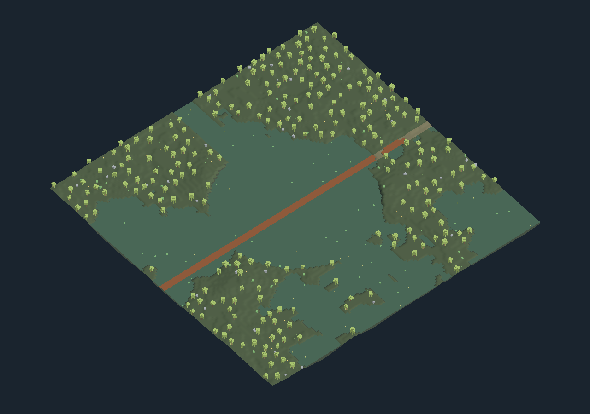
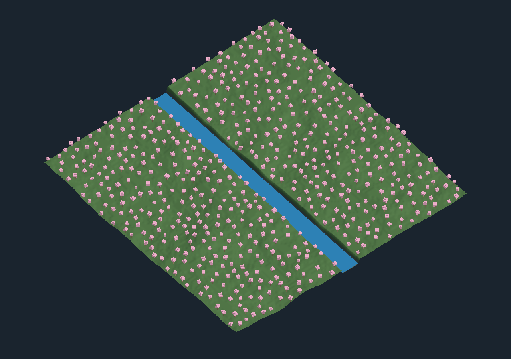
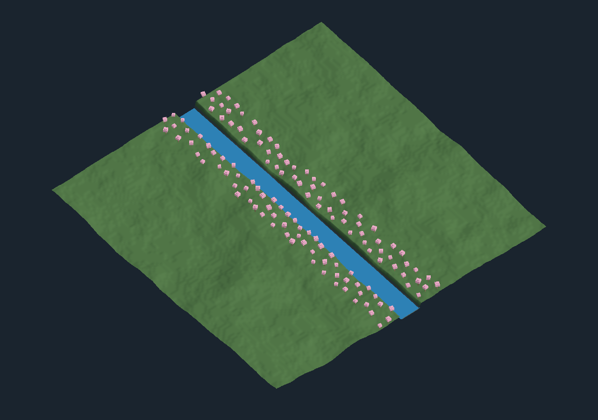

# LLM2PCG

[English](README.md) | [한국어](README.ko.md)

LLM2PCG는 자연어 또는 직접 설정한 파라미터로 3D 가상 월드를 만드는 결정론적 절차적 콘텐츠 생성(PCG) 시스템입니다. LLM이 제작 의도를 간결한 생성 파라미터로 해석하고, 순수 C# 코어가 숲·사막·설원·습지·동굴·도시·던전의 월드 데이터를 생성합니다. 같은 최종 요청과 Seed, 생성기 버전을 사용하면 같은 결과를 재현할 수 있습니다.

생성 결과는 **브라우저(Three.js)와 Unity 6**에서 확인할 수 있으며, **Unreal Engine 연동도 지원 예정**입니다. Unreal 어댑터는 아직 구현되지 않았습니다.



*LLM2PCG로 생성한 숲에 상용 에셋을 적용한 Unity 시연입니다. 생성된 지형과 오브젝트 배치를 실제 게임 환경으로 표현한 예시입니다.*

재현 정보 — **개발 환경의 당시 촬영 기준**: Seed `234` · `128×128` · `DefaultForest` · water threshold `.24` · noise octaves `4` · clearing radius `14` · vegetation distance/max `4/600` · elevation scale/frequency `6/.035` · 기본 visual settings · F1 시작 위치 · F2 UI 숨김 · world hash `E839AE91` · [정확한 요청 JSON](Shared/Examples/legacy-seed234-forest.json)

> 사진의 상용 에셋과 개발용 씬은 이 저장소에 포함되지 않습니다. 공개 데모는 외부 에셋 없이 기본 도형으로 실행할 수 있습니다. 위 요청은 과거 생성기 `forest-biome@1`의 촬영 설정이며 현재 v4 예제와는 다릅니다. 같은 화면을 재현하려면 당시 생성기 구현·에셋·렌더링 설정이 필요합니다. world hash는 이미지 자체의 일치를 의미하지 않습니다.

## 아키텍처

```text
자연어 프롬프트(선택적 OpenAI API 연동)
                         |
                         v
브라우저 UI ---> 검증된 공용 JSON 계약
                         |
              +----------+----------+
              |                     |
              v                     v
       .NET CoreHost          Unity 로컬 Bridge
       순수 생성 알고리즘      메인 스레드 전달
              |                     |
              v                     v
       Three.js 렌더러        Unity 메시/인스턴싱 렌더러
              |                     |
              +----------+----------+
                         v
           결정적 월드 해시와 재현 가능한 결과
```

지원 월드: Dungeon, Cave, Forest, City, Swamp, Snowfield, Desert.

## 생성 예시

2026-09-06에 캡처한 실제 Unity 개발 시연입니다. 이미지의 시각 에셋·재질·시연 씬은 이 저장소에 포함하지 않으며, clone 후 실행하는 기본 데모는 간단한 도형 기반으로 표시됩니다. 아래 이미지는 다양한 생성 결과의 예시이며, 모든 자연어 조건을 완전히 충족했다는 평가 자료는 아닙니다.

| 혼합림 | 벚꽃 숲 |
| --- | --- |
|  |  |
| 사막 | 설원 |
|  |  |
| 습지 | 동굴 |
|  |  |
| 도시 | 던전 |
|  |  |

시드 / 크기: 혼합림 234 / 96×96, 벚꽃 숲 234 / 64×64, 사막 311 / 96×96, 설원 412 / 96×96, 습지 513 / 64×64, 동굴 614 / 64×64, 도시 715 / 96×96, 던전 816 / 64×64. Seed만으로 동일 결과를 재현할 수는 없으며 최종 생성 요청과 같은 생성기 구현이 필요합니다.

### 공간 구조·시각 분포 제어 (v4)

128×128, Seed 234로 생성한 실제 Unity 기본 도형 프리뷰입니다. 외부 아트 에셋 없이 실행할 수 있습니다. `/spatial-v4`의 README 갤러리 목록에서 예제를 선택하고 불러온 뒤 Web 3D를 생성하세요. 파일로 재현하려면 [갤러리 예제 JSON](Shared/Examples/spatial-v4-gallery.json)에서 원하는 항목의 `request`만 별도 JSON으로 저장해 불러옵니다. 갤러리 배열 전체를 업로드하는 방식은 아닙니다.

| 중앙 산 | 중앙 호수 외 수면 금지 |
| --- | --- |
|  |  |
| 관통 강과 별도 교량 | 사막 호수 |
|  |  |
| 설원 중앙 산 | 습지 강과 교량 |
|  |  |
| 유효 지면 전체에 벚꽃 | 강가에만 벚꽃 |
|  |  |

마지막 두 이미지는 Seed·강·나머지 조건을 유지하고 나무 배치 영역만 바꾼 비교입니다. 위 이미지는 확정 파라미터를 제어한 사례이며, 모든 자연어 입력의 해석 정확도를 보장하는 자료는 아닙니다.

## 현재 지원 범위

- 자연어 해석과 직접 JSON 입력, 7종 월드 생성, 시각 카테고리의 종류·밀도·상한 제어를 지원합니다.
- 기존 v3는 7종 월드를 지원하며 `layoutSettings`는 neutral 호환 값만 허용합니다. 저장된 v3 요청을 자동으로 v4로 바꾸지 않습니다.
- 실험적 v4는 숲·사막·설원·습지에서 종류별 산·호수·강 1개씩, 위치 지정, 중앙 관통 강, 호수 외 수면 금지, 길 없음, 직선 길과 별도 교량 레이어를 지원합니다.
- v4의 공통 의미 배치로 종류·영역·Off·상대 밀도·최대 개수를 제어합니다. Unity와 Web은 같은 좌표·회전·크기를 소비하며 재질과 외관은 다릅니다. 기존 v3 브라우저의 시각 배치는 Unity 기능의 일부입니다.
- 도시·동굴·던전 공간 제어, 정확 개수, 자유로운 공간 관계, 군집, 선인장·야자 모델, 보행 가능성 보장은 v4에서 지원하지 않습니다. 설원의 수면은 얼음 색상 표현이며, 걸을 수 있는 얼음으로 검증한 것은 아닙니다.
- Core는 수치·타입 범위를 검증하고 world.diagnostics로 일부 생성 미충족 원인을 제공합니다.
- 동일한 최종 요청과 생성기 구현을 재사용해 재현합니다. 같은 자연어를 LLM에 다시 입력하면 파라미터가 달라질 수 있습니다.

## 요구 사항

- Git
- .NET 8 SDK
- Node.js 20 이상
- PowerShell 7 권장
- Unity 데모용 Unity `6000.5.10f1` — 독립 실행형 브라우저 데모에는 Unity가 필요하지 않습니다

## Clone 및 검증

```powershell
git clone https://github.com/heparidayo/llm2pcg.git
cd llm2pcg
pwsh -File ./Scripts/Test-Clone.ps1
```

검증 스크립트는 lockfile에 고정된 Web 의존성을 설치하고 Web/MCP 테스트, .NET host 빌드, 결정론적 재생성 검사, 기존 일곱 월드와 v4 갤러리 여덟 예제의 API smoke test를 실행합니다. 공개본에 포함되지 않은 개발 전용 fixture 검사는 명시적으로 건너뜁니다.

## 브라우저 데모 실행

```powershell
pwsh -File ./Scripts/Start-StandaloneWeb.ps1
```

브라우저에서 `http://127.0.0.1:3000`을 엽니다. 기본 preset/direct 생성 과정은 로컬에서 동작하며 API key가 필요하지 않습니다. 두 프로세스를 종료하려면 터미널에서 `Ctrl+C`를 누릅니다.

공간 제어는 `http://127.0.0.1:3000/spatial-v4`에서 예제 초안을 확정한 뒤 Web 3D 생성 버튼으로 확인합니다. 최종 JSON을 저장하면 해석 없이 재현할 수 있고, ‘새 Seed로 변형’은 LLM 호출 없이 Seed만 바꿉니다. 같은 요청 ID의 재전송은 현재 서버 프로세스 안에서 중복 처리하지 않으며, 재시작 이후 재현에는 저장 JSON이 필요합니다.

선택적인 자연어 요청 변환 기능을 사용하려면 `Web/.env.example`을 `Web/.env`로 복사하고 본인의 server-side key를 입력하세요. 이 파일은 절대 commit하지 마세요.

## MCP 사용

Standalone 서버를 실행한 뒤 MCP 클라이언트가 `node`와 `MCP/src/server.mjs`의 절대 경로를 인자로 사용하도록 설정합니다. 이 stdio 서버에는 추가 의존성이나 API key가 필요하지 않습니다. `generate_world_v4` 도구에 `{ "request": <확정된 v4 JSON> }`을 전달하면 CoreHost의 월드 데이터를 반환합니다. Unity 씬을 렌더하는 도구는 아닙니다. Core 포트를 변경했다면 `PCG_V4_CORE_ENDPOINT`로 기본 주소 `http://127.0.0.1:8090/api/v4/world/generate`를 바꿉니다.

기존 `generate_world` / `generate_dungeon` 도구는 Unity에서 명시적으로 켠 Bridge `http://127.0.0.1:8088/pcg/generate`로 전송합니다. 주소는 `UNITY_PCG_ENDPOINT`로 변경할 수 있습니다. 로컬 Bridge를 신뢰할 수 없는 네트워크에 노출하지 마세요.

## Unity 데모 실행

1. Unity Hub에서 clone한 저장소의 `UnityDemo` 폴더를 추가합니다.
2. `Assets/PCGPublicDemo/Scenes/PrimitiveDemo.unity`를 엽니다.
3. Play Mode로 진입합니다.
4. 화면의 world type과 seed를 선택합니다. `F1`을 누르면 1인칭 테스트 모드로 전환됩니다.

샘플은 실행 중 카메라, 조명, 생성 pipeline과 fallback material을 구성합니다. 외부 아트 에셋은 필요하지 않습니다. HTTP Bridge는 패키지에서 기본 비활성화되어 있고 loopback 주소만 사용하며, 이 로컬 데모 씬이 `8088` 포트에서 명시적으로 시작합니다.

v4는 Play Mode가 아닌 상태에서 **Tools → LLM2PCG → Experimental v4 → Start HTTP Preview**를 실행합니다. 별도 기본 도형 프리뷰가 loopback `8089`에서 최대 256×256 요청을 받으며 작업 중인 씬은 수정하지 않습니다. `/spatial-v4`의 Unity 생성 버튼을 사용하고, 종료할 때는 프리뷰 창을 닫습니다. Web/Core 데이터 생성은 최대 500×500을 지원합니다.

v3 변환 제안은 `node Scripts/Propose-V4Migration.mjs saved-v3-request.json`으로 출력할 수 있습니다. 경고와 제안된 `request`를 검토해야 하며, 기존 파일을 덮어쓰거나 자동 생성하지 않습니다. 변환된 결과는 기존 월드의 동일 재현이 아니라 새로운 v4 월드입니다.

## Unity 패키지로 재사용

다음 형식의 Git URL을 사용하면 Unity Package Manager에서 패키지 하위 폴더만 설치할 수 있습니다. 특정 버전을 사용하려면 URL 끝의 `<tag>`를 실제 tag로 바꿉니다.

```text
https://github.com/heparidayo/llm2pcg.git?path=/Packages/com.heparidayo.llm2pcg#<tag>
```

또는 clone한 저장소의 `Packages/com.heparidayo.llm2pcg`를 local package로 추가할 수 있습니다.

## 저장소 구성

- `Packages/com.heparidayo.llm2pcg`: 재사용 가능한 Unity runtime과 EditMode 테스트
- `UnityDemo`: 외부 에셋 없는 Unity 데모 프로젝트
- `Standalone`: Unity 없이 생성 가능한 .NET 8 host
- `Web`: Three.js 브라우저 렌더러와 선택적 prompt adapter
- `MCP`: 검증된 확정 요청을 전달하는 stdio 도구
- `Shared`: version이 명시된 JSON Schema와 JavaScript validator/default
- `Scripts`: clone 검증과 로컬 실행 스크립트

프로젝트 전체의 오픈소스 라이선스는 아직 추가하지 않았습니다. 시연 이미지의 게재가 원본 에셋의 사용·재배포 권리를 부여하지는 않습니다.
