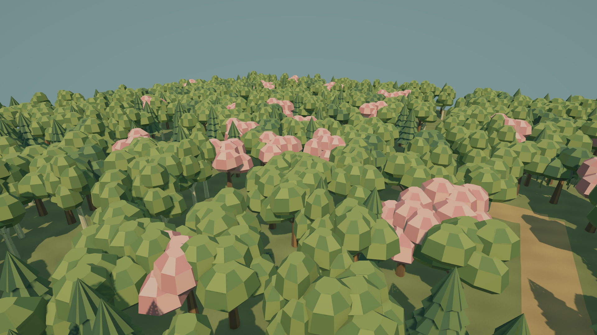
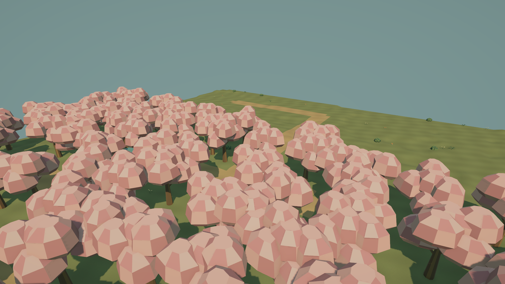
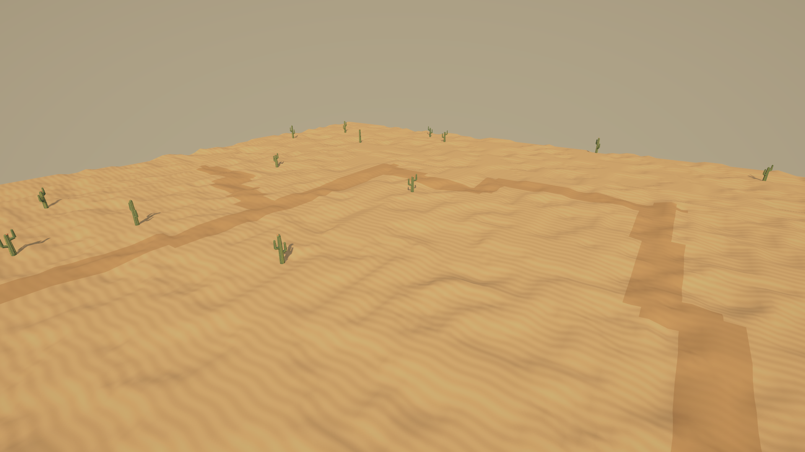
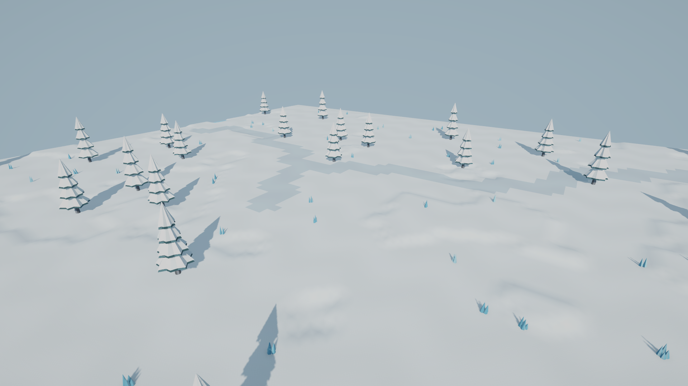
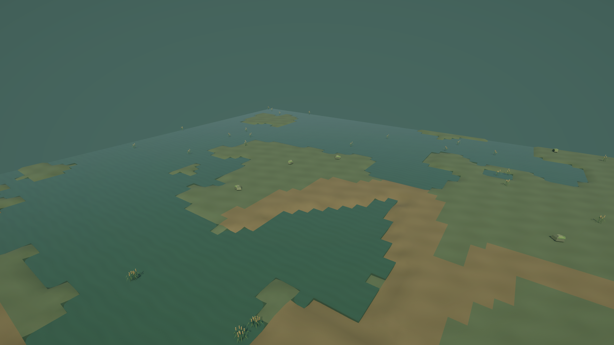
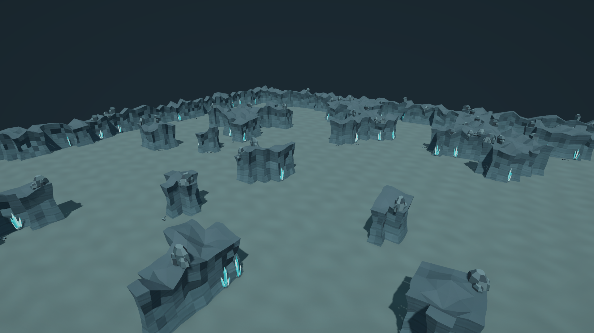
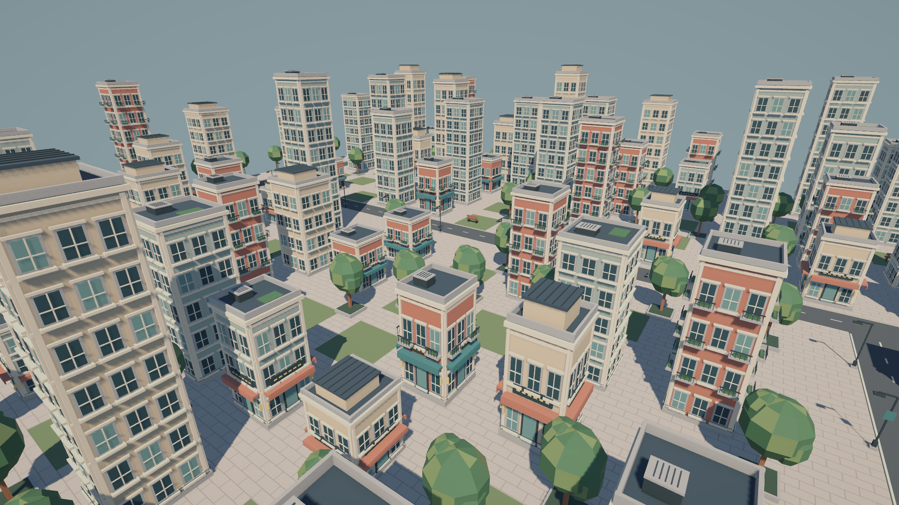
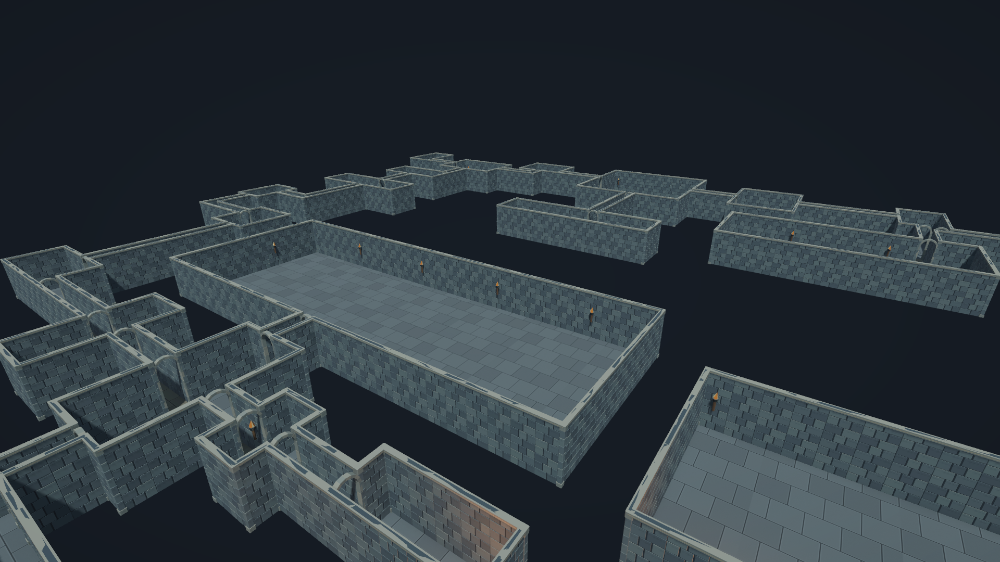

# LLM2PCG

[English](README.md) | [한국어](README.ko.md)

LLM2PCG는 JSON 요청을 기반으로 여러 형태의 월드를 생성하는 결정론적 절차 생성(PCG) 프로젝트입니다. 같은 최종 요청과 생성기 구현을 사용하여 월드 데이터와 해시를 재현할 수 있으며, 결과는 브라우저 또는 Unity 6에서 확인할 수 있습니다.

## 아키텍처

```text
자연어 프롬프트(선택적 OpenAI API 연동)
                         |
                         v
브라우저 UI ---> 검증된 공용 JSON 계약
                         |
              +----------+----------+
              |                     |
              v                     v
       .NET CoreHost          Unity 로컬 Bridge
       순수 생성 알고리즘      메인 스레드 전달
              |                     |
              v                     v
       Three.js 렌더러        Unity 메시/인스턴싱 렌더러
              |                     |
              +----------+----------+
                         v
           결정적 월드 해시와 재현 가능한 결과
```

지원 월드: Dungeon, Cave, Forest, City, Swamp, Snowfield, Desert.

## 생성 예시

2026-09-06에 캡처한 실제 Unity 개발 시연입니다. 이미지의 시각 에셋·재질·시연 씬은 이 저장소에 포함하지 않으며, clone 후 실행하는 기본 데모는 간단한 도형 기반으로 표시됩니다. 아래 이미지는 다양한 생성 결과의 예시이며, 모든 자연어 조건을 완전히 충족했다는 평가 자료는 아닙니다.

| 혼합림 | 벚꽃 숲 |
| --- | --- |
|  |  |
| 사막 | 설원 |
|  |  |
| 습지 | 동굴 |
|  |  |
| 도시 | 던전 |
|  |  |

시드 / 크기: 혼합림 234 / 96×96, 벚꽃 숲 234 / 64×64, 사막 311 / 96×96, 설원 412 / 96×96, 습지 513 / 64×64, 동굴 614 / 64×64, 도시 715 / 96×96, 던전 816 / 64×64. Seed만으로 동일 결과를 재현할 수는 없으며 최종 생성 요청과 같은 생성기 구현이 필요합니다.

## 현재 지원 범위

- 자연어 해석과 직접 JSON 입력, 7종 월드 생성, 시각 카테고리의 종류·밀도·상한 제어를 지원합니다.
- 중앙 산·지정 위치의 강·관통 도로 같은 공간 제어는 현재 비활성입니다. layoutSettings는 neutral 호환 값만 허용합니다.
- Core는 수치·타입 범위를 검증하고 world.diagnostics로 일부 생성 미충족 원인을 제공합니다.
- 동일한 최종 요청과 생성기 구현을 재사용해 재현합니다. 같은 자연어를 LLM에 다시 입력하면 파라미터가 달라질 수 있습니다.

## 요구 사항

- Git
- .NET 8 SDK
- Node.js 20 이상
- PowerShell 7 권장
- Unity 데모용 Unity `6000.5.10f1` — 독립 실행형 브라우저 데모에는 Unity가 필요하지 않습니다

## Clone 및 검증

```powershell
git clone https://github.com/heparidayo/llm2pcg.git
cd llm2pcg
pwsh -File ./Scripts/Test-Clone.ps1
```

검증 스크립트는 lockfile에 고정된 Web 의존성을 설치하고, .NET host 빌드, 결정론적 CoreHost 검사, Web 테스트와 일곱 월드 브라우저/API smoke test를 실행합니다.

## 브라우저 데모 실행

```powershell
pwsh -File ./Scripts/Start-StandaloneWeb.ps1
```

브라우저에서 `http://127.0.0.1:3000`을 엽니다. 기본 preset/direct 생성 과정은 로컬에서 동작하며 API key가 필요하지 않습니다. 두 프로세스를 종료하려면 터미널에서 `Ctrl+C`를 누릅니다.

선택적인 자연어 요청 변환 기능을 사용하려면 `Web/.env.example`을 `Web/.env`로 복사하고 본인의 server-side key를 입력하세요. 이 파일은 절대 commit하지 마세요.

## Unity 데모 실행

1. Unity Hub에서 clone한 저장소의 `UnityDemo` 폴더를 추가합니다.
2. `Assets/PCGPublicDemo/Scenes/PrimitiveDemo.unity`를 엽니다.
3. Play Mode로 진입합니다.
4. 화면의 world type과 seed를 선택합니다. `F1`을 누르면 1인칭 테스트 모드로 전환됩니다.

샘플은 실행 중 카메라, 조명, 생성 pipeline과 fallback material을 구성합니다. 외부 아트 에셋은 필요하지 않습니다. HTTP Bridge는 패키지에서 기본 비활성화되어 있고 loopback 주소만 사용하며, 이 로컬 데모 씬이 `8088` 포트에서 명시적으로 시작합니다.

## Unity 패키지로 재사용

다음 형식의 Git URL을 사용하면 Unity Package Manager에서 패키지 하위 폴더만 설치할 수 있습니다. 특정 버전을 사용하려면 URL 끝의 `<tag>`를 실제 tag로 바꿉니다.

```text
https://github.com/heparidayo/llm2pcg.git?path=/Packages/com.heparidayo.llm2pcg#<tag>
```

또는 clone한 저장소의 `Packages/com.heparidayo.llm2pcg`를 local package로 추가할 수 있습니다.

## 저장소 구성

- `Packages/com.heparidayo.llm2pcg`: 재사용 가능한 Unity runtime과 EditMode 테스트
- `UnityDemo`: 외부 에셋 없는 Unity 데모 프로젝트
- `Standalone`: Unity 없이 생성 가능한 .NET 8 host
- `Web`: Three.js 브라우저 렌더러와 선택적 prompt adapter
- `Shared`: version이 명시된 JSON Schema와 JavaScript validator/default
- `Scripts`: clone 검증과 로컬 실행 스크립트

프로젝트 전체의 오픈소스 라이선스는 아직 추가하지 않았습니다. 시연 이미지의 게재가 원본 에셋의 사용·재배포 권리를 부여하지는 않습니다.
